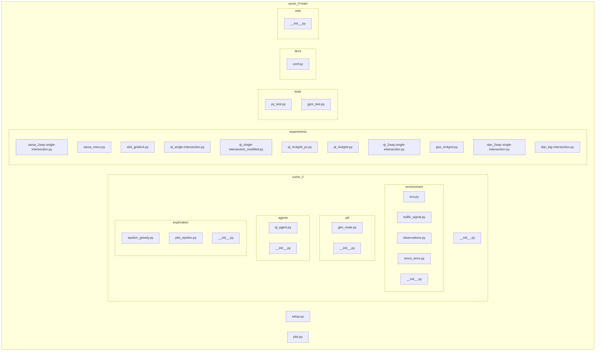

## Architecture Diagram

To render this diagram (Mermaid syntax), you can:
-   Use the links below to open it in Mermaid Live Editor, or
-   Install the [Markdown Preview Mermaid Support](https://marketplace.visualstudio.com/items?itemName=bierner.markdown-mermaid) extension.

For any issues or feature requests, please visit our [GitHub repository](https://github.com/swark-io/swark) or email us at contact@swark.io.

## Generated Content
**Model**: GPT 4o - [Change Model](vscode://settings/swark.languageModel)  
**Mermaid Live Editor**: [View](https://mermaid.live/view#pako:eNqdVcty4yAQ_BUX5ziH3Zx8zh9kb2iLwmIkU8UrPLJRUvn3BWRbksFabVQlMUP39IwGkD5RqxmgA2pUb6k57X49N2oXLxeO44QLUhMr9pJyNUI1eEIWKKg3brWSoPySka4I4ng_muF3CXpLu463xPFeUYGXbj1EHx3YN-q5Vg7PnTrdgms1iQU4PJl1KlfcJxgTkk1S0kCxOz0InotSsgdFrA4e8NVayZ00vpWcRnXvStVXQTKEL8ZK8lHjW-nh3Qht8ypU1t84LrQivQVgA1669XqiWlyIkYjnztq6TTX8zztk4nl334lbxMzfGSyXZd8dtY6SH3_ogCdz77jqBey58mAdtKnMsrqRn7cpntkV4vFnbCBnT-9PeGaXxLjuY2Yyz4yv0_8oqB5OpGa848Du6FzxqmCsM5VLzAdeeGvkGbNKy90-j9tabYy-is_skshe1Sh_MbbpJ_aR9_g8rrDr28uDu91Y5oOkWXwey5z9IEfGxdiSiOn2Jk-rVYfTY0u4gtsy8xFK05uOE_hgcH4uWfFLaULUSKd_QnIsekASbPxRsfhD-2yQP4GEBh12DWLQ0SB8g74iKRhGPTxzGiuV6OBtgAdEg9cvg2ovfvwk9yd06Khw8PUXHQc1lA) | [Edit](https://mermaid.live/edit#pako:eNqdVcty4yAQ_BUX5ziH3Zx8zh9kb2iLwmIkU8UrPLJRUvn3BWRbksFabVQlMUP39IwGkD5RqxmgA2pUb6k57X49N2oXLxeO44QLUhMr9pJyNUI1eEIWKKg3brWSoPySka4I4ng_muF3CXpLu463xPFeUYGXbj1EHx3YN-q5Vg7PnTrdgms1iQU4PJl1KlfcJxgTkk1S0kCxOz0InotSsgdFrA4e8NVayZ00vpWcRnXvStVXQTKEL8ZK8lHjW-nh3Qht8ypU1t84LrQivQVgA1669XqiWlyIkYjnztq6TTX8zztk4nl334lbxMzfGSyXZd8dtY6SH3_ogCdz77jqBey58mAdtKnMsrqRn7cpntkV4vFnbCBnT-9PeGaXxLjuY2Yyz4yv0_8oqB5OpGa848Du6FzxqmCsM5VLzAdeeGvkGbNKy90-j9tabYy-is_skshe1Sh_MbbpJ_aR9_g8rrDr28uDu91Y5oOkWXwey5z9IEfGxdiSiOn2Jk-rVYfTY0u4gtsy8xFK05uOE_hgcH4uWfFLaULUSKd_QnIsekASbPxRsfhD-2yQP4GEBh12DWLQ0SB8g74iKRhGPTxzGiuV6OBtgAdEg9cvg2ovfvwk9yd06Khw8PUXHQc1lA)

